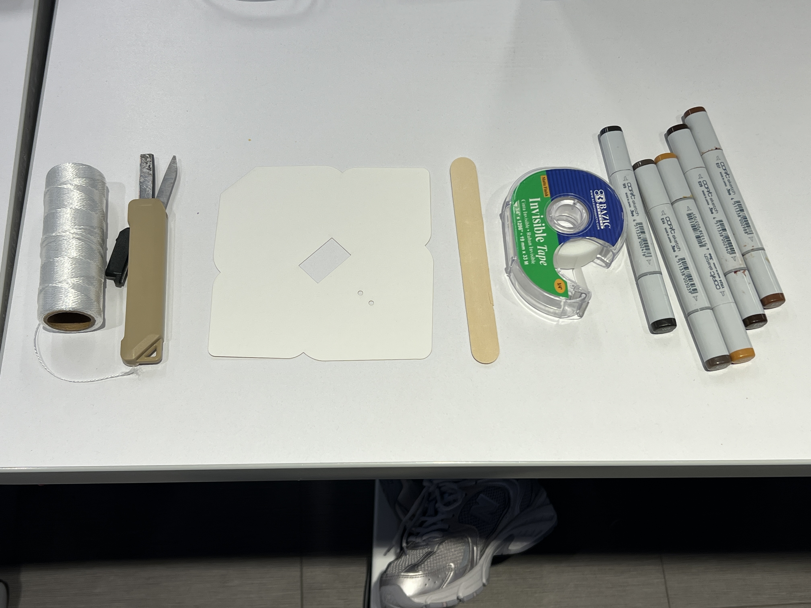
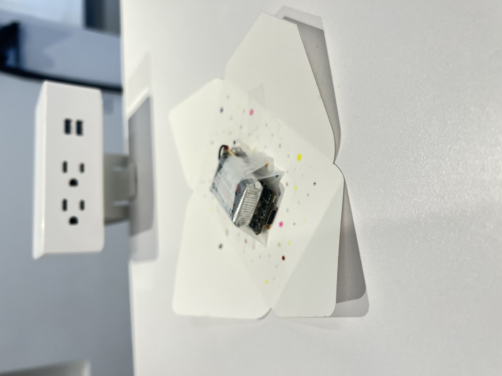

# What Stays
## About
What Stays is a visual art project that explores the transition of relationships through a white dot representing the main person and colored dots representing the people they have a relationship with. Dots move randomly across the screen, disappearing and reappearing while their connections to a white dot remain.
## Demo

  

## Materials Needed
- Envelope
- Coloring materials
- Stick
- Thread
- Tape
- Microcontroller
- Battery
  
 

  

## How to Make It
1. Upload the code from the code folder to your microcontroller using the Arduino IDE. Make sure the TFT_eSPI library is installed and configured for your display.
2. Decorate the envelope using your chosen colors.
3. Connect your Arduino microcontroller to the battery.
4. Tape the battery on top of the Arduino board, then tape them to the inside of the envelope, like shown in the image. Make sure the screen is visible.

   

     
   

5. Tape the envelope closed.
6. Cut a thread about 6 feet long and tie one end to the middle of the stick. You can rotate the stick to make the thread shorter or longer.
7. Insert the other end of the thread through the small holes in the envelope and tie it to the envelope. Than hang the envelope.

## Make The Design Your Own

You can change a few things in the code:

* Number of dots
* Size of dots
* Dot colors
* Movement speed
* Disappearing and reappearing: Change how often the dots disappear and reappear.
* Line colors: Change the color of the lines connecting the dots.

## More Information
Visit my [blog](https://maria-meets-hardware.mta2152.chatgpt.site/projects/project-1) to understand more about the design process. 

